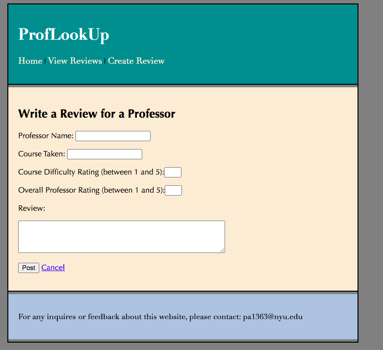
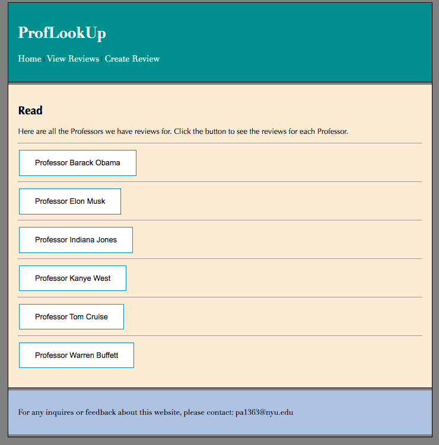
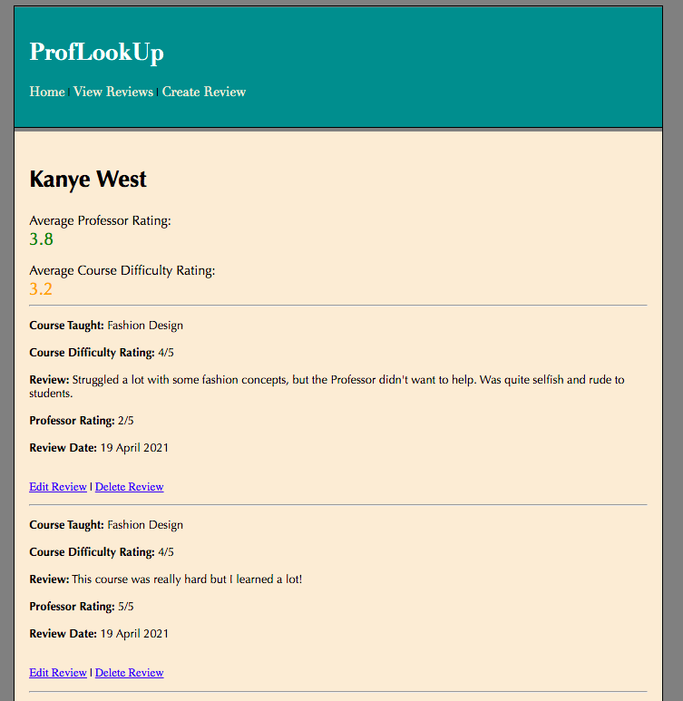

# Flask-MongoDB Web App

My web app aims to create a platform where students can create and view Professor Reviews. My home page consists of a welcome message and the respective links to the View Professor Reviews and Create Review Page.

### Create Review Page:
My create review page allows a student to enter various information about the Professor and the class that he/she teaches. They can enter things such as a Professor Review, Professor Rating (out of 5), Course Difficulty Rating and etc. 

Here is a screenshot of the create review page:

### View Professor Reviews Pages:
My view Professor reviews page allows a student to view the various reviews associated with a certain professor. The first page contains a list of all the Professors that have been reviewed so far.

Here is a screenshot of the first create review page:

Upon clicking the button. The user is redirected to the Professor specific review page. The user can also edit or delete their previously posted reviews.

Here is a screenshot of the second create review page:

## Team 
For this project I worked by myself.